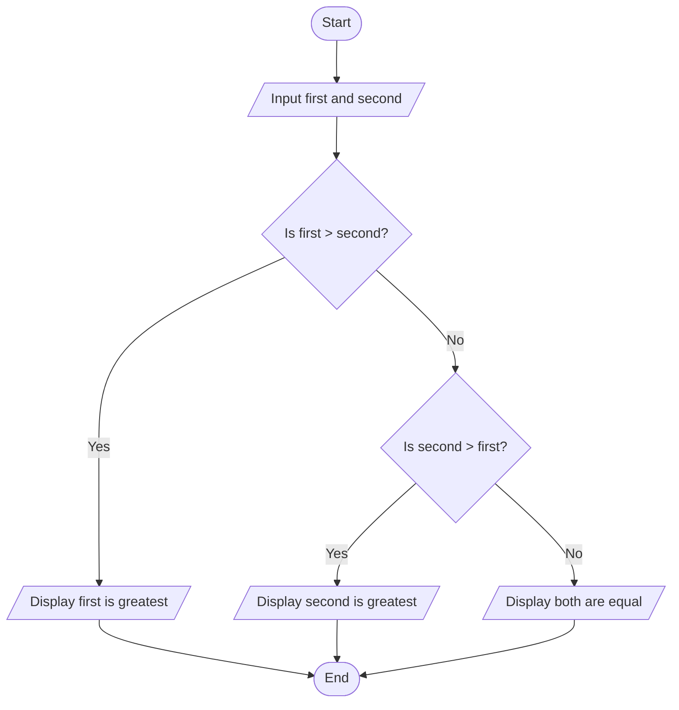

# Greatest of Two Numbers

```mermaid
flowchart TD
    A([Start]) --> B[/Input first and second/]
    B --> C{Is first > second?}
    C -- Yes --> D[/Display first is greatest/]
    C -- No --> E{Is second > first?}
    E -- Yes --> F[/Display second is greatest/]
    E -- No --> G[/Display both are equal/]
    D --> H([End])
    F --> H
    G --> H
```
